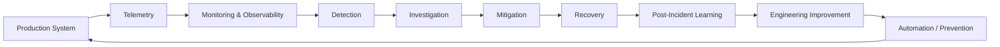
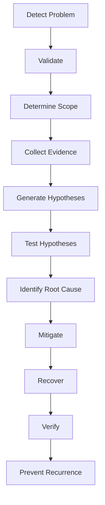
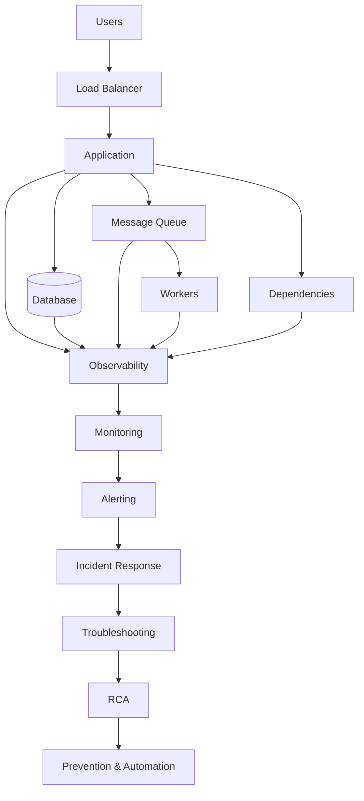

# SRE Knowledge Hub

> **From Absolute Beginner → SRE Fundamentals → Practical SRE → Production SRE → Advanced SRE**

A structured, practical learning repository for understanding **Site Reliability Engineering (SRE)** from first principles and gradually developing the skills required to operate, troubleshoot, monitor, automate, and improve production systems.

---

## Table of Contents

* [What Is This Repository?](#what-is-this-repository)
* [What Is SRE?](#what-is-sre)
* [Why Does SRE Exist?](#why-does-sre-exist)
* [The SRE Mindset](#the-sre-mindset)
* [Who Is This Repository For?](#who-is-this-repository-for)
* [What You Will Learn](#what-you-will-learn)
* [Learning Roadmap](#learning-roadmap)
* [Repository Structure](#repository-structure)
* [Learning Levels](#learning-levels)
* [Prerequisites](#prerequisites)
* [Recommended Learning Order](#recommended-learning-order)
* [How to Use This Repository](#how-to-use-this-repository)
* [How Topics Are Taught](#how-topics-are-taught)
* [Practical Learning Approach](#practical-learning-approach)
* [Troubleshooting Approach](#troubleshooting-approach)
* [Observability Approach](#observability-approach)
* [SLI, SLO and SLA](#sli-slo-and-sla)
* [Incident Management](#incident-management)
* [Reliability Engineering](#reliability-engineering)
* [Automation](#automation)
* [Cloud and Kubernetes](#cloud-and-kubernetes)
* [Production SRE](#production-sre)
* [Advanced SRE](#advanced-sre)
* [Tools](#tools)
* [Hands-On Projects](#hands-on-projects)
* [Case Studies](#case-studies)
* [Finance and Trading SRE](#finance-and-trading-sre)
* [Cheat Sheets](#cheat-sheets)
* [Interview Preparation](#interview-preparation)
* [SRE Learning Philosophy](#sre-learning-philosophy)
* [Final Goal](#final-goal)

---

# What Is This Repository?

The **SRE Knowledge Hub** is a structured learning system designed to take a learner from:

```text
"I know almost nothing about SRE."
                ↓
        Technical Foundations
                ↓
          SRE Fundamentals
                ↓
           Observability
                ↓
       Practical SRE Operations
                ↓
         Production SRE
                ↓
       Reliability Engineering
                ↓
          Advanced SRE
                ↓
       Production Scenarios
                ↓
       Independent SRE Engineer
```

This repository is intentionally designed to be more than a collection of technical notes.

It combines:

* Learning material
* Technical documentation
* Study notes
* Practical exercises
* Troubleshooting scenarios
* Production concepts
* Architecture explanations
* Reliability patterns
* Case studies
* Tool learning
* Cheat sheets
* Interview preparation
* Hands-on projects

The objective is to build **understanding**, not simply memorize terminology.

---

# What Is SRE?

**Site Reliability Engineering (SRE)** is an engineering discipline for operating software systems reliably at scale.

An SRE applies:

* Software engineering
* Systems engineering
* Automation
* Monitoring
* Observability
* Reliability engineering
* Incident management
* Performance engineering
* Capacity planning

to production systems.

A simple mental model is:

```text
Build the system
      ↓
Deploy the system
      ↓
Observe the system
      ↓
Detect problems
      ↓
Troubleshoot
      ↓
Recover
      ↓
Learn from failure
      ↓
Automate
      ↓
Improve reliability
```

SRE is therefore not simply a monitoring role.

It is about **engineering systems and processes so that production services remain reliable while organizations continue to deliver changes**.

---

# Why Does SRE Exist?

Production systems fail.

Examples include:

* Servers running out of memory
* CPU saturation
* Disk exhaustion
* Network failures
* DNS failures
* Database failures
* Application bugs
* Deployment failures
* Dependency failures
* Traffic spikes
* Capacity exhaustion
* Configuration mistakes
* Infrastructure failures

Without an engineering approach, organizations may respond to these problems through increasingly manual operational work.

That creates:

```text
More systems
      ↓
More incidents
      ↓
More manual work
      ↓
More operational toil
      ↓
More human error
      ↓
Even more incidents
```

SRE attempts to break this cycle.

```text
Production problems
        ↓
Measure
        ↓
Understand
        ↓
Engineer a solution
        ↓
Automate
        ↓
Prevent recurrence
        ↓
Improve reliability
```

---

# The SRE Mindset

An SRE continuously asks:

> **What can fail?**

> **How will we know?**

> **How will we investigate it?**

> **How will we recover?**

> **How can we prevent it from happening again?**

This creates the central SRE feedback loop:



---

# Who Is This Repository For?

This repository is designed for:

* SRE beginners
* Freshers
* DevOps engineers
* Cloud engineers
* Platform engineers
* System administrators
* Developers moving into SRE
* Operations engineers
* Production support engineers
* Engineers preparing for SRE interviews
* Engineers working with observability
* Engineers supporting production systems

No assumption is made that the learner already understands SRE.

Technical concepts are introduced progressively.

---

# What You Will Learn

By completing the repository, the learner should understand:

### Technical Foundations

* Computers
* CPU
* Memory
* Storage
* Processes
* Threads
* Operating systems
* Linux
* Networking
* Programming
* Git

### Software and Infrastructure

* Applications
* APIs
* Databases
* Caching
* Queues
* Dependencies
* CI/CD
* Containers
* Cloud
* Kubernetes
* Infrastructure as Code

### Core SRE

* Reliability
* Availability
* Resilience
* Scalability
* Observability
* Monitoring
* Alerting
* SLI
* SLO
* SLA
* Error budgets
* Incident management
* On-call
* Troubleshooting
* RCA
* Toil
* Automation

### Production SRE

* Capacity planning
* Performance engineering
* Distributed systems
* Databases
* Messaging
* Disaster recovery
* Business continuity
* Chaos engineering
* Resilience patterns

### Advanced SRE

* Reliability architecture
* Multi-region systems
* Predictive monitoring
* Anomaly detection
* Forecasting
* Automated remediation
* Self-healing
* AI-assisted SRE
* SRE governance
* SRE maturity
* Reliability reviews

---

# Learning Roadmap

The complete curriculum follows this progression:

```text
LEVEL 0
Technical Foundations
│
├── Computer Fundamentals
├── Linux
├── Networking
├── Programming & Scripting
└── Git
        ↓
LEVEL 1
DevOps Foundations
│
├── Software Engineering
├── CI/CD
├── Containers
├── Cloud
├── Infrastructure as Code
└── Kubernetes
        ↓
LEVEL 2
SRE Foundations
│
├── SRE Fundamentals
├── SRE Principles
├── Observability
├── Monitoring
├── Alerting
└── SLI / SLO / SLA
        ↓
LEVEL 3
Practical SRE
│
├── Incident Management
├── On-Call
├── Troubleshooting
├── Problem Management
├── RCA
└── Runbooks
        ↓
LEVEL 4
Production SRE
│
├── Reliability Engineering
├── Capacity Planning
├── Performance Engineering
├── Databases
├── Distributed Systems
├── Messaging
└── Security
        ↓
LEVEL 5
Advanced Reliability
│
├── Disaster Recovery
├── Business Continuity
├── Chaos Engineering
├── Resilience Engineering
└── Automation
        ↓
LEVEL 6
SRE CoE
│
├── Governance
├── Standards
├── Service Onboarding
├── Reliability Reviews
├── SRE Maturity
└── Analytics
        ↓
LEVEL 7
Advanced SRE
│
├── Advanced Architecture
├── Predictive SRE
├── AI for SRE
├── Self-Healing
└── Advanced Reliability
        ↓
LEVEL 8
Practical Application
│
├── Case Studies
├── Hands-On Projects
├── Production Scenarios
├── Cheat Sheets
└── Interview Preparation
```

---

# Repository Structure

## `00-prerequisites/`

Technical knowledge required before entering deeper SRE topics.

Includes:

* Computer fundamentals
* Operating systems
* Linux basics
* Networking
* Programming
* Command line
* Git

These are **foundations**, not the actual SRE curriculum.

---

## `01-sre-fundamentals/`

Introduces SRE itself.

Topics include:

* What SRE is
* Why SRE exists
* SRE history
* SRE vs DevOps
* SRE vs Operations
* SRE vs Platform Engineering
* SRE principles
* Reliability mindset
* Production mindset
* SRE operating model

---

## `02-computer-systems/`

Explains how computers actually execute workloads.

Topics include:

* CPU
* Memory
* Storage
* Processes
* Threads
* Filesystems
* System resources
* Operating systems
* Failure fundamentals

This gives the learner the foundation needed to understand infrastructure problems.

---

## `03-linux/`

Linux is one of the most important operating environments for SRE.

Topics include:

* Shell
* Commands
* Filesystems
* Permissions
* Processes
* Services
* systemd
* Logs
* Networking
* SSH
* Bash
* Troubleshooting

---

## `04-networking/`

Production systems communicate over networks.

Topics include:

* IP
* Subnets
* Routing
* DNS
* TCP
* UDP
* HTTP
* HTTPS
* TLS
* Proxies
* Load balancers
* Firewalls
* Network troubleshooting

---

## `05-programming-and-scripting/`

SRE does not require becoming a full-time software developer.

The objective is to learn enough programming to:

* Automate tasks
* Work with APIs
* Process data
* Analyze logs
* Build operational scripts
* Automate repetitive work

Primary languages:

* Python
* Bash

Supporting knowledge:

* JSON
* YAML
* APIs
* Regular expressions

---

## `06-git-and-version-control/`

Version control is fundamental to modern infrastructure and software operations.

Topics include:

* Repository
* Commit
* Branch
* Merge
* Rebase
* Pull request
* Conflict resolution
* Tags
* Git workflows

---

## `07-software-engineering-fundamentals/`

An SRE needs to understand what they are operating.

Topics include:

* Applications
* APIs
* Monoliths
* Microservices
* Databases
* Caches
* Queues
* Dependencies
* Configuration
* Secrets
* Logging
* Testing

---

## `08-devops-and-cicd/`

Explains how software moves from source code to production.

```text
Code
 ↓
Build
 ↓
Test
 ↓
Package
 ↓
Artifact
 ↓
Deploy
 ↓
Monitor
 ↓
Operate
```

Topics include:

* CI
* CD
* Build pipelines
* Testing
* Artifacts
* Deployments
* Rolling deployments
* Blue/Green
* Canary
* Feature flags
* Rollbacks
* DORA metrics

---

## `09-containers/`

Explains containerized workloads.

Topics include:

* Container fundamentals
* Images
* Registries
* Dockerfiles
* Volumes
* Networking
* Security
* Troubleshooting

---

## `10-cloud-fundamentals/`

Cloud concepts are taught without requiring the learner to memorize every cloud-provider service.

Core concepts include:

* Regions
* Availability Zones
* Compute
* Storage
* Databases
* Networking
* VPC/VNet
* Load balancing
* Autoscaling
* IAM
* Managed services
* Monitoring
* Security
* Cost
* Reliability

AWS, Azure and GCP implementations can then be studied through the tool tracks.

---

## `11-infrastructure-as-code/`

Infrastructure should be reproducible rather than manually configured wherever practical.

Topics include:

* IaC
* Terraform
* Providers
* Resources
* Variables
* Outputs
* Modules
* State
* Remote state
* Drift
* Secrets
* IaC pipelines

---

## `12-kubernetes/`

Kubernetes is studied after containers and foundational networking/cloud concepts.

Topics include:

* Architecture
* Control plane
* Nodes
* Pods
* Deployments
* Services
* Ingress
* ConfigMaps
* Secrets
* Probes
* Resources
* Scheduling
* Autoscaling
* Storage
* Networking
* RBAC
* Helm
* Production operations
* Troubleshooting

---

# Core SRE

## `13-sre-core/`

This is where the repository transitions from infrastructure knowledge into the actual SRE discipline.

Topics include:

* Service ownership
* Reliability engineering
* Toil
* Automation
* Risk
* Reliability vs delivery
* Shared ownership
* Blameless culture
* Shift-left reliability

---

# Observability

## `14-observability/`

Observability answers:

> **"Can we understand what is happening inside our system from the information the system produces?"**

Core telemetry:

```text
Metrics
Logs
Traces
Events
Profiles
```

Also covered:

* Instrumentation
* OpenTelemetry
* Distributed tracing
* Correlation
* Service maps
* Dependencies
* Golden Signals
* RED
* USE

---

# Monitoring and Alerting

## `15-monitoring-and-alerting/`

Monitoring answers:

> **"What should we continuously watch?"**

Alerting answers:

> **"When should a human or automation be notified?"**

Topics include:

* Infrastructure monitoring
* Application monitoring
* Service monitoring
* Database monitoring
* Network monitoring
* Kubernetes monitoring
* Cloud monitoring
* Synthetic monitoring
* User monitoring
* Business monitoring
* Thresholds
* Baselines
* Anomaly detection
* Alert correlation
* Alert prioritization
* Alert routing
* Alert fatigue

---

# SLI, SLO and SLA

## `16-sli-slo-sla/`

This module establishes how reliability is measured.

```text
SLI
 ↓
What actually happened?

SLO
 ↓
What reliability do we target?

SLA
 ↓
What commitment do we make?

Error Budget
 ↓
How much unreliability can we tolerate?
```

Topics include:

* Availability
* Latency
* Throughput
* Error budgets
* Burn rate
* SLO design
* SLO monitoring
* SLO alerting

---

# Incident Management

## `17-incident-management/`

Production systems eventually experience incidents.

The learner will understand:

```text
Detection
 ↓
Triage
 ↓
Investigation
 ↓
Mitigation
 ↓
Resolution
 ↓
Recovery
 ↓
Verification
 ↓
Closure
 ↓
Learning
```

Topics include:

* Severity
* Priority
* Incident command
* Communication
* Escalation
* War rooms
* Recovery
* Incident metrics

---

# On-Call and Operations

## `18-on-call-and-operations/`

SRE is closely connected to production operations.

Topics include:

* On-call
* Paging
* Escalation
* Rotations
* Handover
* Runbooks
* Playbooks
* Operational readiness
* Production support

---

# Troubleshooting

## `19-troubleshooting/`

The repository uses a consistent troubleshooting framework:

```text
Detect
  ↓
Validate
  ↓
Scope
  ↓
Investigate
  ↓
Identify Root Cause
  ↓
Mitigate
  ↓
Recover
  ↓
Verify
  ↓
Prevent
```

The learner will practice troubleshooting:

* CPU
* Memory
* Disk
* Network
* DNS
* Applications
* Databases
* Kubernetes
* Cloud
* Deployments
* Dependencies
* Performance
* Capacity

---

# Problem Management and RCA

## `20-problem-management-and-rca/`

An incident answers:

> **What is broken right now?**

Problem management asks:

> **Why did this happen, and how do we stop it from recurring?**

Topics include:

* RCA
* Five Whys
* Fishbone
* Fault trees
* Timeline analysis
* Change correlation
* Dependency analysis
* Known errors
* Permanent fixes
* Preventive actions

---

# Reliability Engineering

## `21-reliability-engineering/`

This module explains how systems are designed to survive failure.

Topics include:

* Availability
* Reliability
* MTBF
* MTTR
* Fault tolerance
* Redundancy
* High availability
* Replication
* Failover
* Graceful degradation
* Retries
* Timeouts
* Circuit breakers
* Bulkheads
* Rate limiting
* Load shedding

---

# Capacity Planning

## `22-capacity-planning/`

Capacity planning asks:

> **"Will the system have enough resources to handle future demand?"**

Topics include:

* Demand
* Utilization
* Headroom
* Scaling
* Autoscaling
* Bottlenecks
* Growth
* Forecasting
* Capacity models
* Testing

---

# Performance Engineering

## `23-performance-engineering/`

Performance engineering studies how efficiently systems respond under load.

Topics include:

* Latency
* Response time
* Throughput
* Concurrency
* Resource contention
* CPU-bound workloads
* Memory-bound workloads
* I/O-bound workloads
* Load testing
* Stress testing
* Soak testing
* Benchmarking
* Profiling

---

# Databases

## `24-databases-for-sre/`

An SRE does not necessarily need to become a database administrator.

The objective is to understand database behavior well enough to operate and troubleshoot systems.

Topics include:

* Relational databases
* SQL
* Indexes
* Transactions
* Locks
* Connections
* Connection pools
* Replication
* Failover
* Backups
* Recovery
* Query performance
* NoSQL
* Caching

---

# Distributed Systems

## `25-distributed-systems/`

Modern production systems are often distributed.

This introduces:

* Partial failures
* Network failures
* Dependencies
* Consistency
* Availability
* Partition tolerance
* CAP theorem
* Eventual consistency
* Cascading failures
* Backpressure

This is essential for advanced SRE.

---

# Messaging and Streaming

## `26-messaging-and-streaming/`

Topics include:

* Queues
* Pub/Sub
* Message brokers
* Kafka
* Producers
* Consumers
* Partitions
* Consumer groups
* Offsets
* Replication
* Ordering
* Retries
* Dead-letter queues
* Backpressure
* Consumer lag

---

# Security and DevSecOps

## `27-security-and-devsecops/`

Security is part of production reliability.

Topics include:

* Authentication
* Authorization
* IAM
* Least privilege
* Secrets
* Certificates
* TLS
* Vulnerabilities
* SAST
* DAST
* SCA
* Container security
* Kubernetes security
* Security monitoring
* Compliance

---

# Automation

## `28-automation/`

Automation is one of the central SRE principles.

The progression is:

```text
Manual task
     ↓
Script
     ↓
Reusable automation
     ↓
Event-driven automation
     ↓
Automated remediation
     ↓
Self-healing
```

Topics include:

* Scripts
* APIs
* Runbook automation
* Event-driven automation
* Scheduled automation
* Remediation
* Autoscaling
* Auto-failover
* Rollbacks
* ChatOps
* Workflow automation

---

# Disaster Recovery

## `29-disaster-recovery-and-business-continuity/`

Topics include:

* DR
* Business continuity
* Backups
* Restore
* RTO
* RPO
* Replication
* Failover
* Failback
* DR testing
* DR architecture

---

# Chaos and Resilience

## `30-chaos-and-resilience/`

The objective is to validate whether systems actually behave as expected during failures.

Topics include:

* Chaos engineering
* Failure injection
* Resilience engineering
* Game days
* Network failures
* Service failures
* Database failures
* Kubernetes failures
* Node failures
* Region failures

---

# SRE CoE and Governance

## `31-sre-governance-and-coe/`

This is the organizational layer.

An SRE CoE establishes reusable standards and practices across teams.

Topics include:

* SRE standards
* Reliability standards
* Monitoring standards
* Alert standards
* SLO standards
* Incident standards
* Runbook standards
* Dashboard standards
* Service onboarding
* Operational readiness reviews
* Reliability reviews
* Architecture reviews
* Change management
* SRE maturity

---

# SRE Analytics

## `32-sre-analytics-and-reporting/`

This module focuses on using reliability data to make engineering decisions.

Examples include:

* Availability trends
* SLO compliance
* Error-budget consumption
* Incident trends
* Alert trends
* Toil
* Capacity
* Reliability trends

The goal is not to collect metrics simply because they are available.

The goal is to answer:

> **"What does this data tell us about the reliability of the system?"**

---

# Dynatrace

## `33-dynatrace/`

Dynatrace is maintained as a dedicated technology track rather than being the definition of SRE.

The learner first understands:

```text
Observability
     ↓
Monitoring
     ↓
Metrics / Logs / Traces
     ↓
SRE use cases
     ↓
Dynatrace implementation
```

The Dynatrace track covers:

* Platform architecture
* OneAgent
* ActiveGate
* Smartscape
* Service flow
* Metrics
* Logs
* Events
* Distributed tracing
* Dashboards
* SLOs
* Alerting
* Problem management
* Davis AI
* Workflows
* Kubernetes monitoring
* Cloud monitoring
* DQL
* RCA
* Predictive monitoring
* Automation

---

# Advanced SRE

## `34-advanced-sre/`

Topics include:

* Advanced observability
* Advanced Kubernetes
* Reliability architecture
* Multi-region systems
* Advanced distributed systems
* Advanced capacity planning
* Advanced performance
* Reliability trade-offs
* Cost vs reliability
* Reliability reviews
* Production readiness

---

# Predictive SRE

## `35-predictive-sre/`

Traditional SRE often asks:

> **"What is going wrong?"**

Predictive SRE additionally asks:

> **"What is likely to go wrong next?"**

The progression is:

```text
Historical Data
      ↓
Baseline
      ↓
Anomaly Detection
      ↓
Forecasting
      ↓
Risk Prediction
      ↓
Early Warning
      ↓
Automated Remediation
```

Topics include:

* Historical analysis
* Baselining
* Anomaly detection
* Forecasting
* Capacity prediction
* Failure prediction
* Alert prediction
* Incident prediction
* Risk scoring
* Predictive remediation
* AI-assisted RCA

---

# AI for SRE

## `36-ai-for-sre/`

AI can assist SRE activities such as:

* Monitoring analysis
* Log analysis
* RCA
* Incident summarization
* Alert correlation
* Anomaly detection
* Predictive analytics
* Runbook generation
* Incident copilots
* Automated remediation

The repository will also cover the limitations and risks of AI-assisted operations.

AI should **assist engineering judgment**, not blindly replace it.

---

# Case Studies

## `37-case-studies/`

The repository includes production-style scenarios.

Examples:

* High CPU
* Memory leak
* Disk full
* Service unavailable
* High latency
* Increased error rate
* DNS failure
* Database connection exhaustion
* Kubernetes pod crash
* Deployment failure
* Certificate expiry
* Network connectivity failure
* Kafka consumer lag
* Traffic spike
* Capacity exhaustion
* Cloud dependency failure
* Cascading failure

Every case follows a common structure:

```text
Symptom
 ↓
Impact
 ↓
Detection
 ↓
Initial Triage
 ↓
Investigation
 ↓
Root Cause
 ↓
Mitigation
 ↓
Recovery
 ↓
Permanent Fix
 ↓
Monitoring Improvement
 ↓
Prevention
```

---

# Hands-On Projects

## `38-hands-on-projects/`

Knowledge becomes useful when it can be applied.

Projects progress from simple exercises to production-style systems.

```text
Theory
  ↓
Simple Exercise
  ↓
Hands-On Lab
  ↓
Failure Injection
  ↓
Troubleshooting
  ↓
Production Scenario
  ↓
Engineering Improvement
```

Projects include:

* Linux monitoring
* Web-service observability
* SLO monitoring
* Incident management
* Kubernetes SRE
* CI/CD reliability
* Automated remediation
* Capacity planning
* Distributed systems
* End-to-end production SRE

---

# Finance and Trading SRE

## `39-finance-trading-sre/`

This is an **optional domain specialization**.

It is intentionally separated from the core SRE curriculum.

A learner does **not** need to understand financial markets to understand SRE.

The specialization is useful for engineers supporting financial or trading systems.

Topics include:

* Trading-system architecture
* Market data
* Order management
* Order routing
* Trading venues
* Trading-system latency
* Trading-volume patterns
* Market hours
* Trading calendars
* Trading-system observability
* Trading-system reliability
* Predictive monitoring

The emphasis is on understanding **how business behavior affects reliability and monitoring**.

---

# Tools

## `tools/`

Tools are deliberately separated from the conceptual curriculum.

The principle is:

> **Learn the concept first. Learn the implementation tool second.**

For example:

```text
Observability
      ↓
Metrics
      ↓
Logs
      ↓
Traces
      ↓
Dashboards
      ↓
Alerting
      ↓
THEN
      ↓
Dynatrace
Prometheus
Grafana
Elastic
OpenTelemetry
etc.
```

The tools section will contain deep-dive tracks for technologies such as:

### Observability

* Dynatrace
* Prometheus
* Grafana
* Elastic
* OpenSearch
* Splunk
* Loki
* Jaeger
* OpenTelemetry

### Cloud

* AWS
* Azure
* GCP

### Containers

* Docker
* Kubernetes
* Helm

### CI/CD

* Jenkins
* GitHub Actions
* GitLab CI
* Azure DevOps

### Infrastructure

* Terraform
* Ansible
* CloudFormation

### Programming

* Python
* Bash
* PowerShell
* Java
* SQL

### Incident Management

* ServiceNow
* PagerDuty
* Opsgenie
* Jira

### Messaging

* Kafka
* RabbitMQ
* AWS messaging services
* Azure messaging services

### Security

* Vault
* SonarQube
* Trivy
* Dependency scanning tools

Each major tool will be learned through:

```text
What
 ↓
Why
 ↓
Architecture
 ↓
Components
 ↓
Installation
 ↓
Configuration
 ↓
Core concepts
 ↓
Usage
 ↓
Monitoring
 ↓
Alerting
 ↓
Querying
 ↓
Automation
 ↓
Integrations
 ↓
Security
 ↓
Scaling
 ↓
Troubleshooting
 ↓
Performance
 ↓
Production operations
 ↓
Best practices
 ↓
Hands-on labs
 ↓
Production scenarios
```

The exact topics will be adapted to the tool rather than forcing an artificial template onto every technology.

---

# Hands-On Projects

Projects are designed to combine multiple concepts.

For example:

```text
Linux
 +
Networking
 +
Application
 +
Docker
 +
Kubernetes
 +
Observability
 +
SLO
 +
Alerting
 +
Incident Response
 +
Automation
```

The final project should resemble a simplified production environment rather than an isolated tutorial.

---

# Troubleshooting Approach

Every troubleshooting exercise uses the same mental model:



The objective is to avoid random command execution.

A production engineer should be able to explain:

1. What happened?
2. Who or what is affected?
3. When did it start?
4. What changed?
5. What evidence supports the hypothesis?
6. What is the safest mitigation?
7. How do we verify recovery?
8. How do we prevent recurrence?

---

# Observability Approach

Observability is taught as a system-wide capability.

```text
                    System
                      │
       ┌──────────────┼──────────────┐
       ↓              ↓              ↓
    Metrics          Logs          Traces
       │              │              │
       └──────────────┼──────────────┘
                      ↓
                Correlation
                      ↓
               Investigation
                      ↓
                Root Cause
                      ↓
                 Resolution
```

The repository covers:

* Metrics
* Logs
* Traces
* Events
* Profiles
* Instrumentation
* Correlation
* Service dependencies
* Distributed tracing
* Dashboards
* Alerting

The goal is not to create thousands of dashboards.

The goal is to make systems **understandable during normal operation and failure**.

---

# SLI, SLO and SLA

These concepts provide a framework for discussing reliability.

```text
SLI
"What did the system actually do?"

        ↓

SLO
"What level of reliability do we want?"

        ↓

SLA
"What reliability commitment do we make?"

        ↓

Error Budget
"How much unreliability can we accept?"
```

SLOs connect technical reliability with business expectations.

They help answer questions such as:

> Should we prioritize another feature or reliability work?

> How much downtime is acceptable?

> Is the service meeting its reliability objective?

---

# Incident Management

Incident management provides a structured response to production problems.

```text
Alert
 ↓
Detection
 ↓
Triage
 ↓
Investigation
 ↓
Mitigation
 ↓
Resolution
 ↓
Recovery
 ↓
Verification
 ↓
Post-Incident Review
 ↓
Prevention
```

The repository covers both the **technical** and **human** aspects of incidents.

This includes:

* Incident command
* Communication
* Escalation
* Handover
* War rooms
* Runbooks
* Postmortems
* Corrective actions

---

# Reliability Engineering

Reliability engineering goes beyond detecting failures.

It asks how systems can be designed to tolerate failures.

Examples include:

```text
Redundancy
Fault tolerance
Replication
Failover
Retries
Timeouts
Circuit breakers
Bulkheads
Rate limiting
Load shedding
Graceful degradation
```

The objective is:

> **When something fails, the entire system should not necessarily fail with it.**

---

# Automation

Automation is used to reduce repetitive operational work.

The progression is:

```text
Manual Operation
       ↓
Script
       ↓
Reusable Automation
       ↓
Event-Driven Automation
       ↓
Automated Remediation
       ↓
Self-Healing
```

Automation should be introduced carefully.

A bad automation can turn a small failure into a large outage.

Therefore the repository also teaches:

* Validation
* Safety checks
* Rollback
* Idempotency
* Observability
* Approval boundaries
* Failure handling

---

# Cloud and Kubernetes

Cloud and Kubernetes are important technologies in modern production environments, but they are **implementation environments for SRE**, not definitions of SRE.

The learner first understands:

```text
System
 ↓
Application
 ↓
Infrastructure
 ↓
Networking
 ↓
Deployment
 ↓
Observability
 ↓
Reliability
```

Then learns how those concepts are implemented using:

* Cloud platforms
* Containers
* Kubernetes
* Infrastructure as Code

---

# Production SRE

Production SRE connects all the individual concepts.

A production system can be viewed as:



A production SRE must understand the relationship between all of these components.

---

# Advanced SRE

Advanced SRE builds on the fundamentals.

Topics include:

* Reliability architecture
* Multi-region systems
* Advanced distributed systems
* Advanced Kubernetes
* Advanced observability
* Advanced performance
* Capacity forecasting
* Resilience engineering
* Disaster recovery
* Chaos engineering
* Cost vs reliability
* Reliability trade-offs
* Production readiness

---

# Predictive SRE

Predictive SRE extends traditional monitoring.

Traditional:

```text
Something is failing
        ↓
Detect it
        ↓
Respond
```

Predictive:

```text
Historical behavior
        ↓
Baseline
        ↓
Detect abnormal behavior
        ↓
Forecast
        ↓
Predict risk
        ↓
Act before impact
```

This area connects closely with:

* Anomaly detection
* Forecasting
* Capacity prediction
* Predictive monitoring
* AI-assisted RCA
* Automated remediation

---

# SRE CoE

A **Site Reliability Engineering Center of Excellence** provides centralized standards, practices, guidance, tooling patterns, and reusable capabilities for SRE across an organization.

A CoE can define:

* Reliability standards
* SLO standards
* Monitoring standards
* Alert standards
* Incident standards
* Runbook standards
* Dashboard standards
* Service onboarding requirements
* Reliability reviews
* Operational readiness reviews
* Architecture reviews
* SRE maturity models

A simplified model is:

```text
                     SRE CoE
                        │
       ┌────────────────┼────────────────┐
       ↓                ↓                ↓
   Standards        Enablement       Governance
       │                │                │
       ↓                ↓                ↓
    SLOs            Tooling          Reviews
    Alerts          Automation       Policies
    Incidents       Templates        Standards
    Runbooks        Platforms        Maturity
```

---

# Practical Learning Approach

The repository follows:

```text
Concept
  ↓
Why it exists
  ↓
Simple analogy
  ↓
Technical explanation
  ↓
Architecture
  ↓
Example
  ↓
Hands-on exercise
  ↓
Failure scenario
  ↓
Troubleshooting
  ↓
Production application
  ↓
Remember This
```

This prevents the learner from memorizing isolated definitions.

---

# How Topics Are Taught

For important topics, the repository answers:

### What?

What is the technology or concept?

### Why?

Why does it exist?

### Problem

What problem does it solve?

### How?

How does it work?

### Components

What are its important parts?

### Architecture

Where does it fit into a production system?

### Monitoring

What should an SRE monitor?

### Failure

What can go wrong?

### Troubleshooting

How should the problem be investigated?

### Production

How is it used in real environments?

### SRE Perspective

Why does this matter for reliability?

### Remember This

What are the few concepts the learner should retain?

---

# Prerequisites

No prior SRE knowledge is required.

The repository starts with foundational knowledge.

Recommended prerequisites:

```text
Basic computer usage
      ↓
Computer fundamentals
      ↓
Linux
      ↓
Networking
      ↓
Programming basics
      ↓
Git
      ↓
Software fundamentals
      ↓
DevOps
      ↓
SRE
```

A learner who already knows a prerequisite can skip or skim that section.

---

# Recommended Learning Order

Do not randomly jump between modules.

Follow the numbered sequence.

### Foundation

```text
00 Prerequisites
01 SRE Fundamentals
02 Computer Systems
03 Linux
04 Networking
05 Programming
06 Git
```

### Engineering Foundations

```text
07 Software Engineering
08 DevOps & CI/CD
09 Containers
10 Cloud
11 Infrastructure as Code
12 Kubernetes
```

### Core SRE

```text
13 SRE Core
14 Observability
15 Monitoring & Alerting
16 SLI/SLO/SLA
```

### Operations

```text
17 Incident Management
18 On-Call
19 Troubleshooting
20 Problem Management & RCA
```

### Reliability

```text
21 Reliability Engineering
22 Capacity Planning
23 Performance Engineering
24 Databases
25 Distributed Systems
26 Messaging
27 Security
28 Automation
29 Disaster Recovery
30 Chaos & Resilience
```

### SRE CoE

```text
31 SRE Governance & CoE
32 SRE Analytics
```

### Advanced

```text
33 Dynatrace
34 Advanced SRE
35 Predictive SRE
36 AI for SRE
```

### Practice

```text
37 Case Studies
38 Hands-On Projects
```

### Optional Specialization

```text
39 Finance & Trading SRE
```

### Revision and Career

```text
40 Cheat Sheets
41 Interview Preparation
```

---

# How to Use This Repository

For each module:

1. Read the topic in sequence.
2. Understand the concept.
3. Draw or inspect the architecture.
4. Try the example.
5. Perform the hands-on exercise.
6. Intentionally investigate a failure.
7. Review the troubleshooting process.
8. Read the production scenario.
9. Review the **Remember This** section.
10. Move to the next topic.

Avoid trying to memorize everything.

Focus on understanding relationships.

---

# Tools vs Concepts

One of the most important principles of this repository is:

> **A tool is not the concept.**

For example:

```text
Monitoring
    ↓
Concept

Dynatrace
Prometheus
Grafana
    ↓
Implementations
```

Similarly:

```text
Containerization
    ↓
Concept

Docker
    ↓
Implementation
```

And:

```text
Container orchestration
    ↓
Concept

Kubernetes
    ↓
Implementation
```

This distinction prevents tool-specific knowledge from replacing engineering fundamentals.

---

# Commonly Missed SRE Topics

This repository intentionally includes topics that are frequently absent from simplified SRE learning paths:

* Toil
* Error-budget policy
* Burn-rate alerting
* Alert engineering
* Alert fatigue
* Service ownership
* Operational readiness
* Production readiness
* Dependency failures
* Partial failures
* Cascading failures
* Backpressure
* Load shedding
* Graceful degradation
* Connection exhaustion
* Capacity headroom
* Change correlation
* Deployment correlation
* Recovery verification
* Failback
* DR testing
* On-call handover
* Incident communication
* Runbook quality
* Reliability reviews
* Architecture reviews
* SRE governance
* Service onboarding
* SRE maturity
* Cost vs reliability
* Automated remediation
* Self-healing
* Reliability trade-offs

---

# Case Studies

Production-style case studies are treated as a major learning component.

Example:

```text
High CPU
   ↓
Alert
   ↓
Validate
   ↓
Check affected services
   ↓
Check recent deployment
   ↓
Check traffic
   ↓
Check process behavior
   ↓
Identify cause
   ↓
Mitigate
   ↓
Verify recovery
   ↓
Perform RCA
   ↓
Improve monitoring
   ↓
Automate prevention
```

The objective is to develop **engineering reasoning**, not merely memorize commands.

---

# Cheat Sheets

The repository contains concise revision material for:

* Linux
* Networking
* Git
* Docker
* Kubernetes
* Cloud
* Terraform
* Observability
* SLI/SLO/SLA
* Incident management
* Troubleshooting
* Reliability
* SRE interviews

Cheat sheets are for **revision**, not a replacement for the main learning material.

---

# Interview Preparation

The interview section focuses on understanding rather than memorized answers.

It includes:

* SRE fundamentals
* Linux
* Networking
* Cloud
* Kubernetes
* Observability
* SLOs
* Incident management
* Troubleshooting
* Reliability
* Distributed systems
* Scenario-based questions
* Production scenarios

A good SRE interview answer should explain:

```text
Concept
 ↓
Reasoning
 ↓
Trade-off
 ↓
Production example
 ↓
Failure handling
```

---

# SRE Learning Philosophy

The repository is built around several principles.

### 1. Understand before memorizing

Do not memorize:

> "Kubernetes has Pods."

Understand:

> Why do workloads need an abstraction for running containers?

---

### 2. Learn dependencies first

Do not explain Kubernetes networking before teaching basic networking.

Do not explain SLO burn rates before teaching SLOs.

Do not explain distributed tracing before explaining traces.

---

### 3. Connect everything to production

For every important technology, ask:

```text
How does it work?
       ↓
What can fail?
       ↓
How will I know?
       ↓
How will I troubleshoot it?
       ↓
How will I recover it?
       ↓
How will I prevent it?
```

---

### 4. Automate repetitive work

If an operational task is:

* repetitive
* predictable
* measurable
* safe to automate

it should be considered as an automation candidate.

---

### 5. Reliability is a system property

Reliability does not belong exclusively to the SRE team.

It involves:

```text
Developers
Operations
SRE
Platform
Security
Architecture
Product
Business
```

SRE helps establish the engineering practices that make reliability measurable and manageable.

---

# Final Goal

The goal of this repository is not:

> **"Learn as many SRE tools as possible."**

The goal is:

> **"Understand how production systems work, how they fail, how to observe them, how to troubleshoot them, how to recover them, how to measure reliability, and how to engineer them to become more reliable."**

By the end of the learning path, the learner should be able to think like this:

```text
                    Production System
                           │
                           ↓
                     What can fail?
                           │
                           ↓
                   How will we know?
                           │
                           ↓
                    How do we scope it?
                           │
                           ↓
                    How do we investigate?
                           │
                           ↓
                    What is the root cause?
                           │
                           ↓
                    How do we mitigate?
                           │
                           ↓
                    How do we recover?
                           │
                           ↓
                    How do we verify?
                           │
                           ↓
                 How do we prevent recurrence?
                           │
                           ↓
                      AUTOMATION
                           │
                           ↓
                  BETTER RELIABILITY
```

That is the central learning objective of the **SRE Knowledge Hub**.

---

## Repository Philosophy

**Learn the fundamentals.**

**Understand the system.**

**Observe the system.**

**Measure reliability.**

**Respond to failure.**

**Troubleshoot systematically.**

**Engineer resilience.**

**Automate toil.**

**Learn from incidents.**

**Continuously improve production reliability.**
